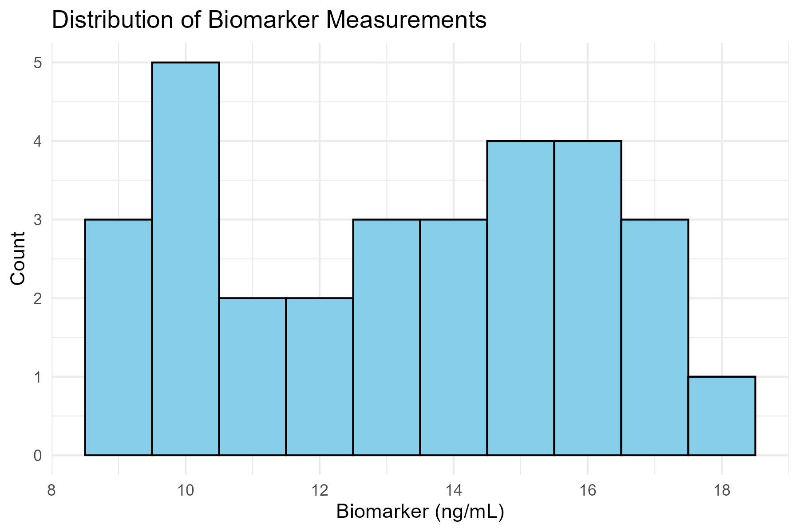
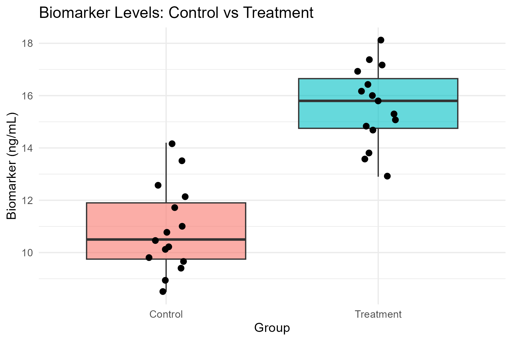
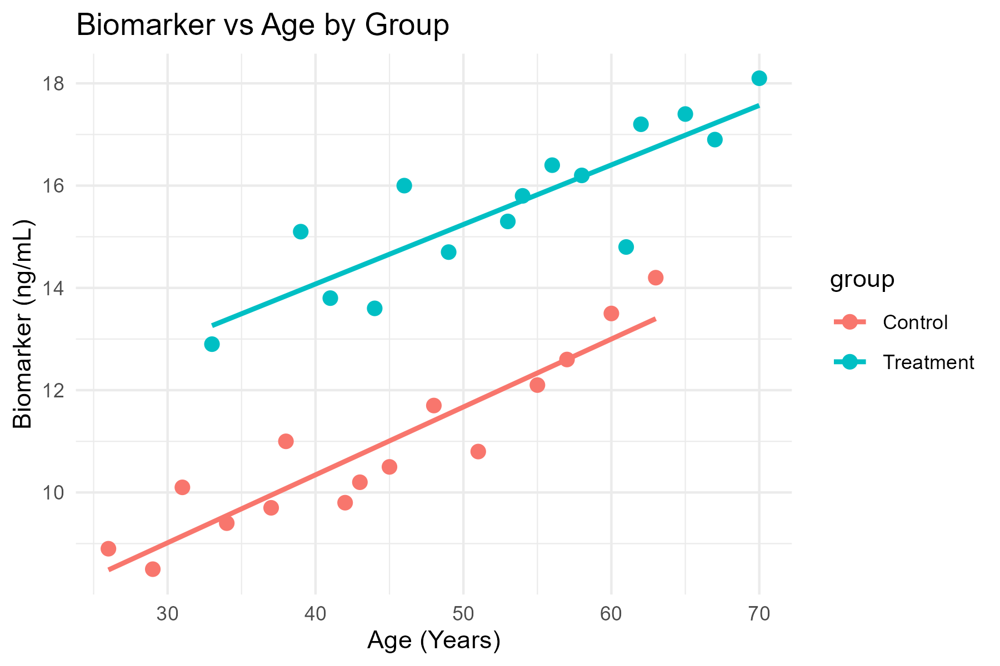
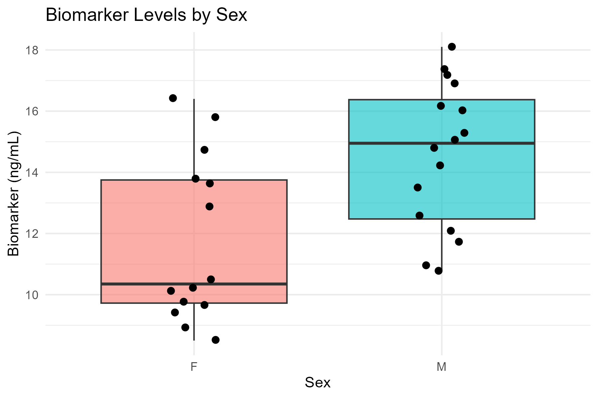

```{r setup, include=FALSE}
knitr::opts_chunk$set(echo = TRUE, warning = FALSE, message = FALSE)
library(tidyverse)
library(knitr)
```

## Dataset Overview

```{r load-data}
df <- readRDS("data/processed_data.rds")
glimpse(df)
```

------------------------------------------------------------------------

## Exploratory Questions 

### 1. How are the biomarker measurements distributed?

Biomarker concentrations range from 8.5 ng/mL to 18.1 ng/mL with an overall mean of approximately 13.24 ng/mL.

```{r fig1, fig.cap="Distribution of Biomarker Concentration"}

```

------------------------------------------------------------------------

### 2. Does the treatment group appear different from the control group?

YES. The Control group has a mean level of **10.87 ng/mL**, whereas the Treatment group has a mean level of **15.61 ng/mL**.

```{r fig2, fig.cap="Control vs Treatment Biomarker Comparison"}

```

------------------------------------------------------------------------

### 3. Does age appear to influence the biomarker?

YES. There is a positive correlation between age and biomarker concentration in both study arms.

```{r fig3, fig.cap="Biomarker vs Age Stratified by Group"}

```

------------------------------------------------------------------------

### 4. Does sex appear to influence the biomarker?

YES, males display higher than females, but driven by AGE.

```{r fig4, fig.cap="Biomarker Levels by Sex"}

```

------------------------------------------------------------------------

### 5. Potential Confounding Factors

The Treatment group is systematically older than the Control group. Because age strongly elevates biomarker levels and is a confounding factor when assessing treatment efficacy.


------------------------------------------------------------------------

### 6. Outliers or Unusual Observations

No numerical anomalies or extreme values in the dataset.

------------------------------------------------------------------------

### 7. Additional Information Needed Before Drawing Conclusions

1.  Longitudinal pre-treatment vs. post-treatment measurements.
2.  Equal distribution of age and sex across treatment arms.
3.  Additional clinical metadata like disease severity.

------------------------------------------------------------------------

## Reproducibility

```{r session-info}
sessionInfo()
```
